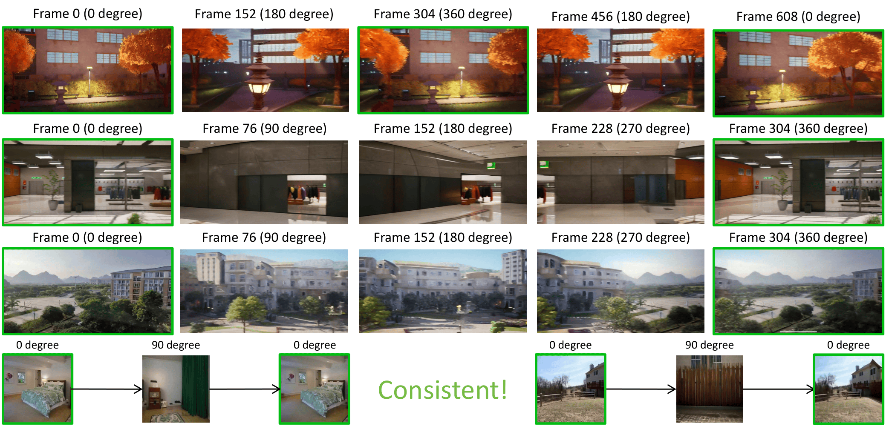
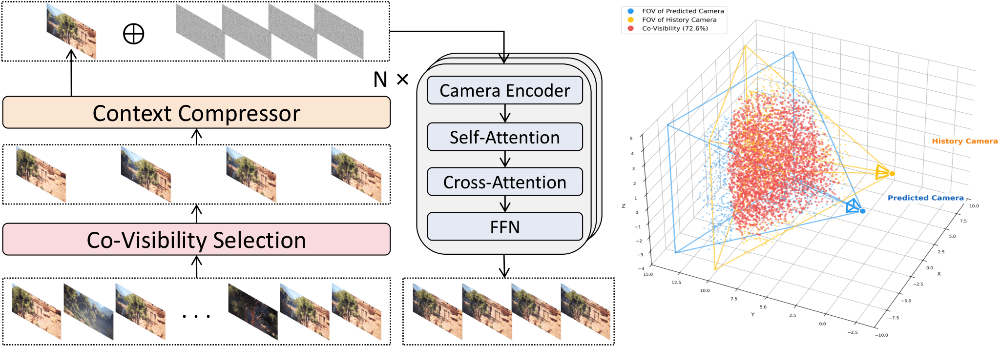

<div align="center">
  <h1>🎥MemCam🎥</h1>
  <h3>Memory-Augmented Camera Control for Consistent Video Generation</h3>
  <p>🎉<strong>IJCNN 2026</strong>🎉</p>
  <a href='https://arxiv.org/abs/2603.26193'></a> &nbsp;&nbsp;
  <a href='https://newhorizon2005.github.io/MemCam'></a> &nbsp;&nbsp;
  <a href='https://huggingface.co/newhorizon2005/MemCam'></a> &nbsp;&nbsp;
</div>

## 📄 Paper

> **MemCam: Memory-Augmented Camera Control for Consistent Video Generation**  
> *Xinhang Gao, et al.*  
> *International Joint Conference on Neural Networks (IJCNN), 2026*

---

<p align="center">
   
</p>

---

## 🚀 Overview

Existing interactive video generation methods struggle to maintain scene consistency under large camera rotations over long time horizons — they either rely on fixed-length context windows that cannot cover distant viewpoints (e.g., DFoT), or introduce 3D reconstruction that inevitably accumulates errors (e.g., GeometryForcing).

**MemCam** addresses this by treating previously generated frames as **dynamically retrievable external memory**, enabling long-range scene consistency without 3D reconstruction. The framework is built on the Wan2.1 1.3B DiT and introduces two key designs:

- A **Context Compression Module** that encodes historical frames into compact representations via spatial 2× downsampling, reducing token count to 1/4 and achieving ~5× inference speedup with minimal quality loss.
- A **Co-Visibility-Based Context Retrieval** strategy that uses Monte Carlo FOV overlap estimation to dynamically select the most viewpoint-relevant historical frames for each predicted frame, rather than simply using the most recent ones.

<p align="center">
  
</p>

---

## ✨ Key Features

- 🧠 **External Memory Mechanism** – Maintains all historical frames as retrievable memory, enabling faithful scene reconstruction even after 360° camera rotations.
- 🎯 **Co-Visibility Retrieval** – Dynamically selects context frames based on camera FOV overlap, ensuring each predicted frame is conditioned on the most relevant history.
- ⚡ **Efficient Context Compression** – Compresses historical frame tokens to 1/4 via spatial downsampling, achieving ~5× speedup over uncompressed baselines at comparable quality.
- 📊 **Strong Results** – ~80% FVD reduction over the strongest baseline on 360° round-trip benchmarks; significant zero-shot gains on RealEstate10K.

---

## 🛠️ Installation

### 1. Clone the repository
```bash
git clone https://github.com/newhorizon2005/MemCam.git
cd MemCam
```

### 2. Create conda environment
```bash
conda create -n memcam python=3.10 -y
conda activate memcam
```

### 3. Install Requirements
```bash
pip install torch==2.4.0 torchvision==0.19.0 torchaudio==2.4.0 --index-url https://download.pytorch.org/whl/cu124
pip install -r requirements.txt
pip install -e .
```

### 4. Download Wan2.1 base model
```bash
python utils/download_wan2.1.py
```

This will download the Wan2.1-T2V-1.3B base model to `models/Wan-AI/Wan2.1-T2V-1.3B`.

### 5. Download MemCam weights
```bash
huggingface-cli download newhorizon2005/MemCam --local-dir models/MemCam
```

---

## 🎬 Inference
```bash
python inference_memcam.py \
    --input_image assets/test.png \
    --pose_path assets/test.json \
    --prompt "The video begins with a scene where sunlight filters through an unseen source, creating a hazy atmosphere over a rocky landscape. As the video progresses, the haze gradually clears to reveal more of the environment, including greenery and rocks that suggest a natural setting, possibly near a water body given the presence of reflections on the surface. The light continues to play a significant role in altering the visibility and mood of the scene.As time passes, the clarity improves significantly, allowing for a detailed view of the lush vegetation and various rock formations within what appears to be a serene outdoor area. The camera's subtle movements offer different perspectives of this tranquil setting, emphasizing the textures and colors of the environment under changing lighting conditions.Towards the latter part of the video, the focus shifts slightly to include architectural elements like columns or structures, hinting at human influence or historical significance in the otherwise untouched natural surroundings. This new addition suggests a blend of nature and civilization, enhancing the narrative depth of the location being showcased.Throughout the video, there is no visible movement of objects or characters, indicating a static observation of the environment. The consistent quality of light and the gradual unveiling of details create a sense of progression and discovery, culminating in a richer understanding of the setting without any discernible action or dynamic change occurring."
```

---

## 🏋️ Training

### 1. Download dataset

We train on the [Context-as-Memory](https://huggingface.co/datasets/KlingTeam/Context-as-Memory-Dataset) dataset.
```bash
# Download and extract
hf download KlingTeam/Context-as-Memory-Dataset --repo-type=dataset
cat Context-as-Memory-Dataset_* > Context-as-Memory-Dataset.zip
```

### 2. Preprocess dataset
```bash
# convert frames to videos
python dataset/videos.py

# preprocess context frame latents
python dataset/singles.py

# preprocess main dataset
./process.sh
```

### 3. Train
```bash
./train.sh
```

---

## 📝 Citation

If you find this work useful, please consider citing:
```bibtex
@misc{gao2026memcammemoryaugmentedcameracontrol,
      title={MemCam: Memory-Augmented Camera Control for Consistent Video Generation}, 
      author={Xinhang Gao and Junlin Guan and Shuhan Luo and Wenzhuo Li and Guanghuan Tan and Jiacheng Wang},
      year={2026},
      eprint={2603.26193},
      archivePrefix={arXiv},
      primaryClass={cs.CV},
      url={https://arxiv.org/abs/2603.26193}, 
}
```
